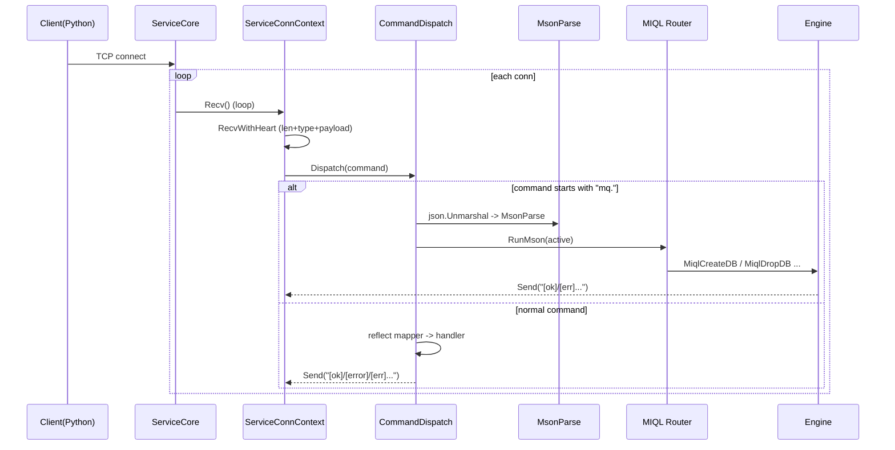
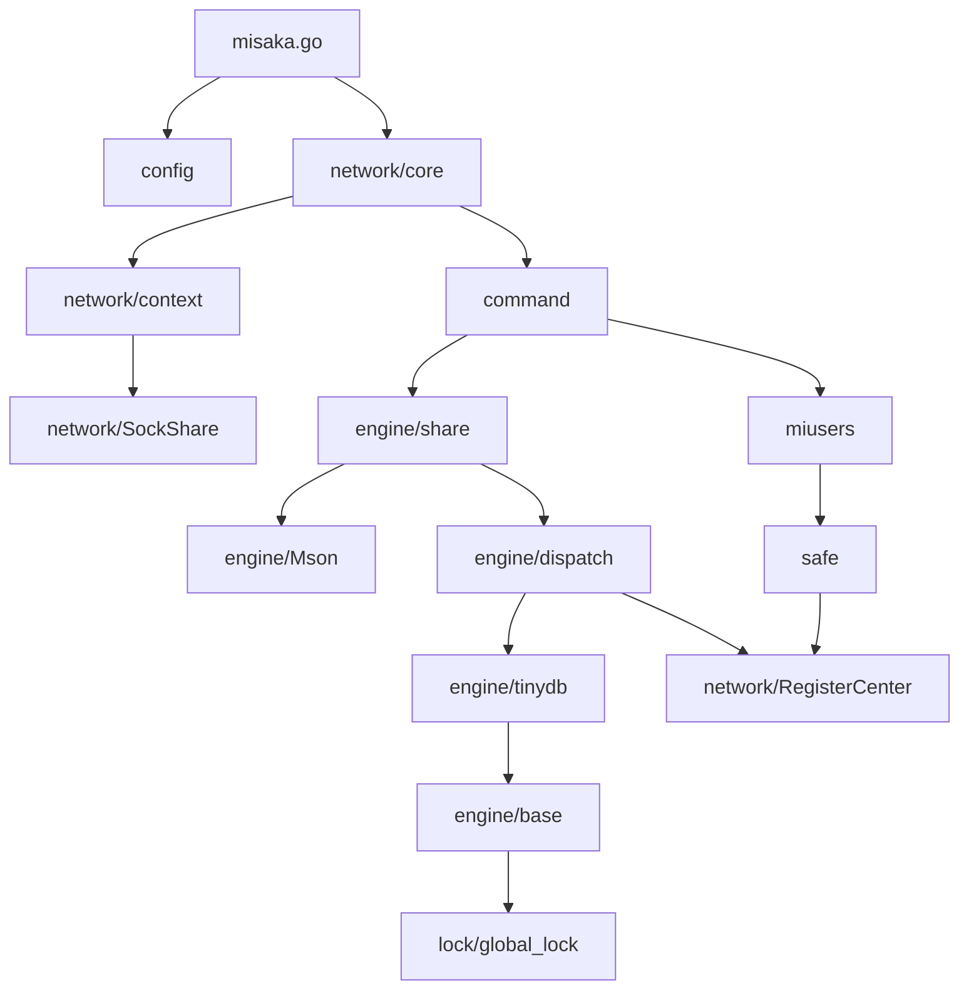

# 02. 整体架构

## 分层视角

- **入口层**：`misaka.go`（参数/配置加载、启动 ServiceCore）
- **网络层**：`network/core`（TCP accept、连接协程）、`network/context`（连接上下文）、`network/SockShare`（带心跳的 framing）
- **命令层**：`command/`（普通命令 + MIQL 通道的统一分发）
- **引擎层**：`engine/`（Mson 解析 → MIQL 路由 → Engine/Loader/Executor）
- **基础设施**：`lock/`（全局锁池）、`safe/`（AES）、`miusers/`（用户体系）、`clilog/`（日志）

## 关键链路：从连接到执行

### 时序（服务端视角）

### 关键入口与函数

- 服务端入口：[misaka.go](file:///workspace/misaka.go)
  - `main()`：解析参数、加载 `MisakaConfigure`、创建 `ServiceCore` 并运行
- TCP accept 与 per-conn loop：[ServiceCore.Run/handlerConn](file:///workspace/network/core/ServiceCore.go)
- 连接上下文收发：[ServiceConnContext.Recv/Send](file:///workspace/network/context/ServiceConnContext.go)
- 心跳 framing（收包）：[RecvWithHeart](file:///workspace/network/SockShare/Heater.go)
- 命令总分发：[MiqlCommDispatch.Dispatch](file:///workspace/command/CommandDispatch.go)
- MIQL 路由：[RunMson](file:///workspace/engine/share/miql.go)

## 依赖关系（高层）

## 数据与状态

### 连接状态（ServiceConnContext）

每条 TCP 连接对应一个 `ServiceConnContext`，目前承载：

- `LoginUser`：是否已登录以及当前用户
- `UseDatabase`：当前使用中的 DB（目前未看到在命令链路里被真正使用）

定义位置：[ServiceConnContext](file:///workspace/network/context/ServiceConnContext.go#L13-L18)

### 数据落盘路径（tinydb）

当前默认 DB 根目录为 `./db-datas/<dbname>/`，元信息在内部隐藏目录 `./db-datas/<dbname>/.db/meta.json`。

初始化逻辑：[TinyDBLoaderImp.InitLoader](file:///workspace/engine/tinydb/components/TinyDBLoader.go#L58-L124)

